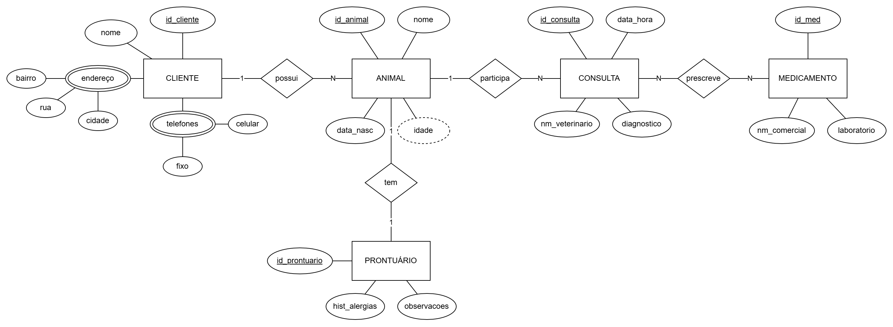

# 🐾 VetPatas - Sistema de Gerenciamento de Clínica Veterinária

Este repositório contém o **Projeto Completo de Banco de Dados** desenvolvido para a disciplina de Modelagem de Banco de Dados. O projeto simula um sistema real para a clínica veterinária fictícia **VetPatas**, abrangendo desde a concepção do cenário até a implementação física e relatórios estratégicos.

---

## 1. 🏢 Cenário

A **VetPatas** é uma clínica veterinária em expansão que necessita informatizar seus processos de atendimento. Atualmente, o controle é feito manualmente, o que gera erros e lentidão.

**Objetivo do Sistema:**
Gerenciar o cadastro de clientes e seus animais, manter um histórico médico único (prontuário) para cada animal, registrar agendamentos de consultas e controlar os medicamentos prescritos.

**Regras de Negócio Identificadas:**
* **Cliente:** Pode possuir vários animais, endereços e telefones.
* **Animal:** Pertence a um único dono e possui um único prontuário médico exclusivo.
* **Consulta:** Um animal pode passar por várias consultas ao longo da vida.
* **Medicamento:** Uma consulta pode resultar na prescrição de vários medicamentos.

---

## 2. 📐 Modelagem Conceitual (DER)

O Diagrama Entidade-Relacionamento (DER) foi criado para representar graficamente as entidades e seus relacionamentos, seguindo o modelo de Peter Chen.

**Entidades Principais:**
* `CLIENTE`
* `ANIMAL`
* `PRONTUÁRIO`
* `CONSULTA`
* `MEDICAMENTO`



---

## 3. 🧮 Modelagem Lógica

Nesta etapa, o modelo conceitual foi traduzido para o modelo relacional (tabelas), com a definição de chaves primárias (PK) e estrangeiras (FK) e a normalização dos dados.

**Principais Decisões de Projeto:**
* O atributo multivalorado **Telefone** foi transformado na tabela `TELEFONES`.
* O atributo composto **Endereço** foi normalizado na tabela `ENDERECO`.
* A relação N:N entre Consulta e Medicamento foi implementada, neste escopo, associando o medicamento à consulta realizada.


---

## 4. 🧱 Modelagem Física (SQL)

O banco de dados foi implementado utilizando a linguagem **SQL** no SGBD **MySQL**.

* **Script de Criação Completo:** [script_completo_clinica.sql](script_completo_clinica.sql)

**Estrutura das Tabelas:**
```sql
CREATE TABLE CLIENTE (...);
CREATE TABLE ENDERECO (...);
CREATE TABLE TELEFONES (...);
CREATE TABLE ANIMAL (...);
CREATE TABLE PRONTUARIO (...);
CREATE TABLE CONSULTA (...);
CREATE TABLE MEDICAMENTO (...);
```

O banco foi povoado com dados massivos para teste de carga. A consulta abaixo valida a quantidade de registros inseridos (meta: 500 registros por tabela).

```sql
SELECT 
    (SELECT COUNT(*) FROM CLIENTE) AS clientes,
    (SELECT COUNT(*) FROM ANIMAL) AS animais,
    (SELECT COUNT(*) FROM CONSULTA) AS consultas;
```

**Resultado Esperado:**

| clientes | animais | consultas |
|----------|---------|-----------|
| 500      | 500     | 500       |

---

## 🔄 5. Operações CRUD

Exemplos de manipulação de dados implementados no sistema.

### Create (Inserir)

```sql
INSERT INTO CLIENTE (nome) VALUES ('João CRUD');
INSERT INTO ANIMAL (nome, data_nasc, id_cliente) VALUES ('Totó', '2023-01-01', 501);
```

### Read (Consultar)

```sql
SELECT c.nome AS Dono, a.nome AS Pet 
FROM CLIENTE c 
JOIN ANIMAL a ON c.id_cliente = a.id_cliente 
WHERE c.nome = 'João CRUD';
```

### Update (Atualizar)

```sql
UPDATE ANIMAL SET nome = 'Rex' WHERE nome = 'Totó' AND id_cliente = 501;
```

### Delete (Remover)

```sql
DELETE FROM ANIMAL WHERE id_cliente = 501;
DELETE FROM CLIENTE WHERE id_cliente = 501;
```

---

## 📈 6. Relatórios Gerenciais (Business Intelligence)

Consultas SQL avançadas desenvolvidas para extrair inteligência do banco de dados.

### 1. Relatório Geral de Clientes e Pets
*Lista ordenada de todos os clientes e seus respectivos animais.*

```sql
SELECT c.nome AS Dono, a.nome AS Pet, a.data_nasc 
FROM CLIENTE c 
JOIN ANIMAL a ON c.id_cliente = a.id_cliente 
ORDER BY c.nome ASC;
```

### 2. Segmentação Geográfica (SP)
*Contatos de clientes que residem na cidade de SP.*

```sql
SELECT c.nome, t.celular, e.bairro 
FROM CLIENTE c 
JOIN ENDERECO e ON c.id_cliente = e.id_cliente 
JOIN TELEFONES t ON c.id_cliente = t.id_cliente 
WHERE e.cidade LIKE '%SP%';
```

### 3. Animais com Histórico de Alergia
*Identificação de pacientes com riscos alérgicos registrados no prontuário.*

```sql
SELECT a.nome AS Animal, c.nome AS Dono, p.hist_alergias 
FROM ANIMAL a 
JOIN CLIENTE c ON a.id_cliente = c.id_cliente 
JOIN PRONTUARIO p ON a.id_animal = p.id_animal 
WHERE p.hist_alergias != 'Nenhuma';
```

### 4. Produtividade por Veterinário
*Ranking de atendimentos realizados por profissional.*

```sql
SELECT nm_veterinario, COUNT(*) AS Total_Consultas 
FROM CONSULTA 
GROUP BY nm_veterinario 
ORDER BY Total_Consultas DESC;
```

### 5. Análise de Medicamentos (Laboratório BioVet)
*Rastreabilidade de uso de medicamentos de um laboratório específico.*

```sql
SELECT m.nm_comercial, a.nome AS Animal, cons.data_hora 
FROM MEDICAMENTO m 
JOIN CONSULTA cons ON m.id_consulta = cons.id_consulta 
JOIN ANIMAL a ON cons.id_animal = a.id_animal 
WHERE m.laboratorio = 'BioVet' 
ORDER BY cons.data_hora;
```

### 6. Histórico Unificado do Cliente
*Visão 360º de um cliente específico (Ex: ID 50), mostrando pets e consultas.*

```sql
SELECT c.nome, a.nome AS Pet, cons.data_hora, cons.diagnostico 
FROM CLIENTE c 
JOIN ANIMAL a ON c.id_cliente = a.id_cliente 
JOIN CONSULTA cons ON a.id_animal = cons.id_animal 
WHERE c.id_cliente = 50;
```

### 7. Monitoramento de Risco
*Busca textual no prontuário por termos de alerta (ex: "Monitorar").*

```sql
SELECT a.nome, p.observacoes 
FROM PRONTUARIO p 
JOIN ANIMAL a ON p.id_animal = a.id_animal 
WHERE p.observacoes LIKE '%Monitorar%';
```

### 8. Casos de Otite e Tratamento
*Relação de animais diagnosticados com Otite e a medicação prescrita.*

```sql
SELECT a.nome, cons.diagnostico, m.nm_comercial 
FROM CONSULTA cons 
JOIN ANIMAL a ON cons.id_animal = a.id_animal 
JOIN MEDICAMENTO m ON cons.id_consulta = m.id_consulta 
WHERE cons.diagnostico LIKE '%Otite%';
```

---
© 2025 VetPatas Project.
